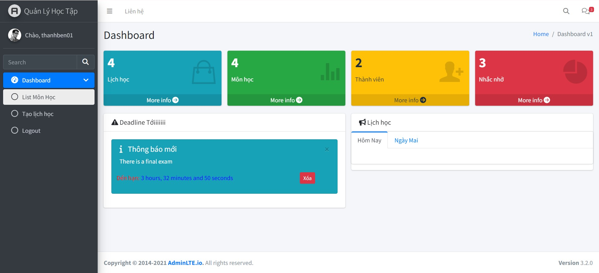
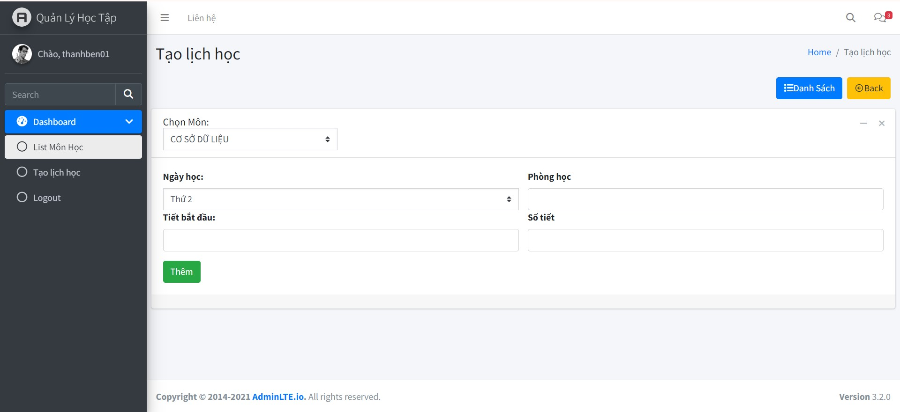
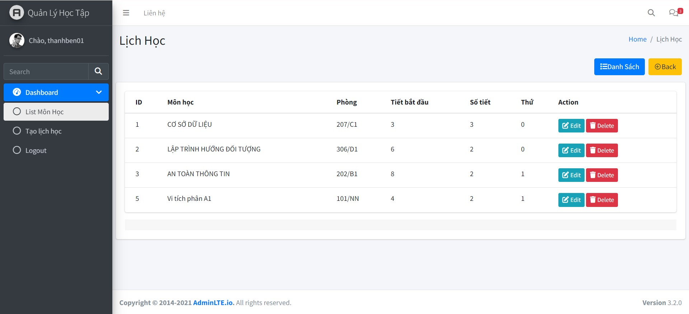
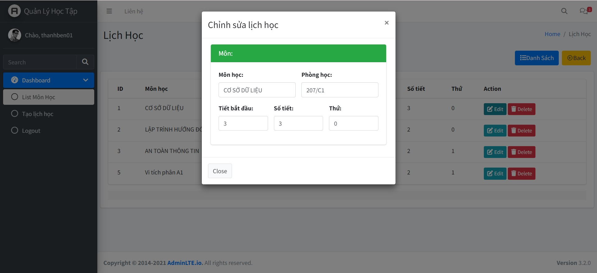
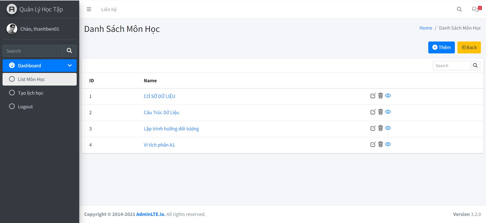
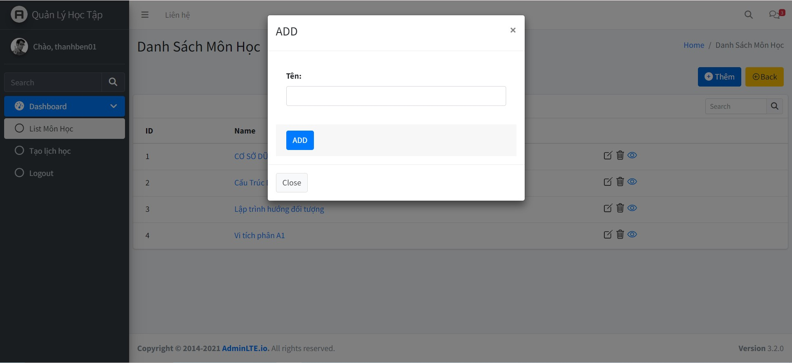
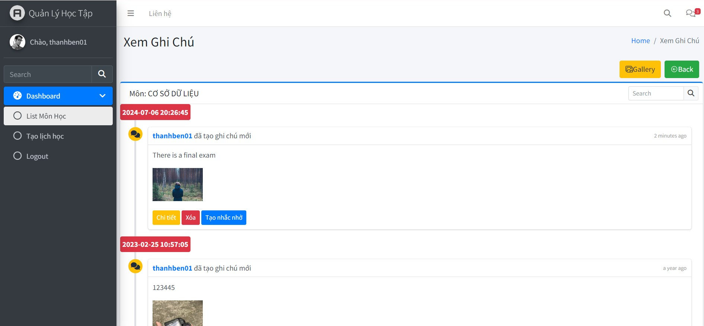
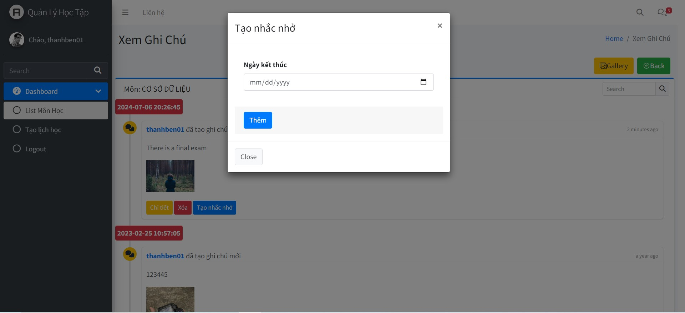
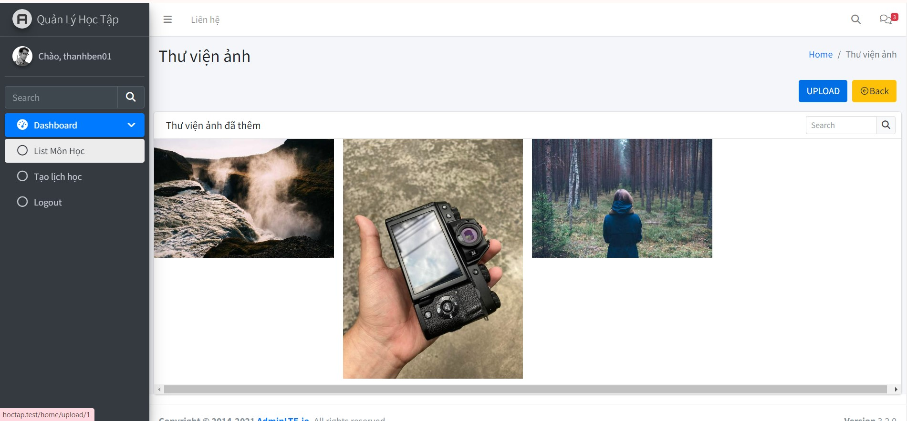
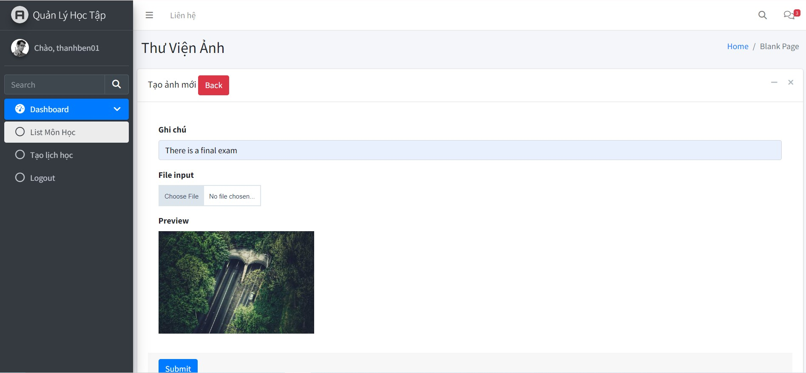

# Learning Management.

## About this Project:
Learning Management helps students create class schedules, create notes and photos for each subject, avoid losing study materials or missing teacher reminders in class.

Connect with me at:

    
  &nbsp;&nbsp;
  

  📫 How to reach me: <a href='mailto:nben19732@gmail.com'>nben19732@gmail.com</a>

## Technology Used:
- PHP
- Mysql
- Ajax/JQuery
- Cloudinary (cloud photo storage)

## Features
- Create / edit / delete schedule
- Create / edit / delete subject
- Subject photo library
- Create a reminder for a note, it will appear on the home page
- Upload photos through the Cloudinary service, which is a cloud storage service
## Screen 

